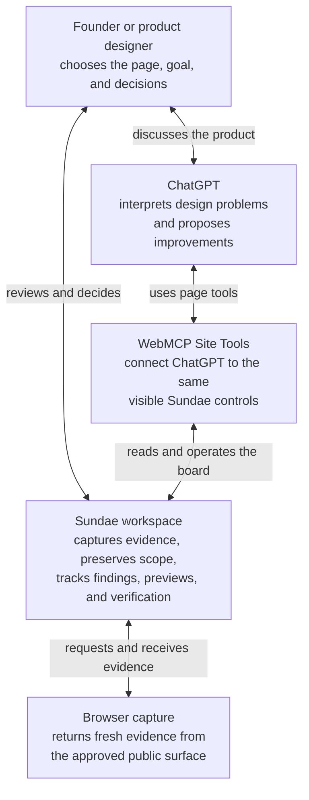
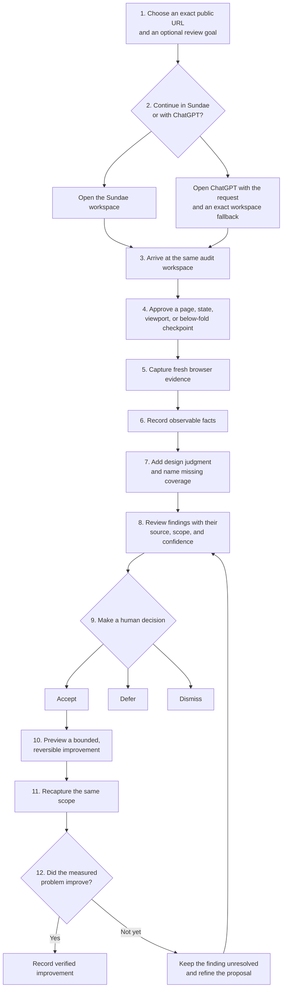

# Sundae

## An evidence-backed way to improve a public website

> Product overview · Sundae V1 · August 2026

Most website feedback arrives as an opinion: “this feels confusing,” “the page looks dated,” or “the call to action needs more energy.” The team then has to work out what the reviewer saw, whether the problem is real, and how anyone will know that a change improved it.

Sundae gives that work a shared place. A founder or product designer chooses a public page and states what they want to improve. Sundae captures the approved surface, records what the browser can observe, and keeps each finding connected to its evidence. The person can then use their own judgment or work with ChatGPT to decide what matters, preview a bounded change, and verify the result with a fresh capture.

Sundae is a product-design review workspace. WebMCP supports the experience by letting ChatGPT use the same visible workspace and controls. WebMCP is not the customer problem that Sundae solves.

## Who Sundae is for

Sundae is designed for people who own the quality of a digital product but do not want to begin with developer tools. The primary user is an early-stage founder or product designer reviewing a public product or marketing surface.

That person often needs to answer four practical questions:

- What is making this page harder to understand or use?
- Which problems have visible evidence behind them?
- What should we change first?
- Did the change improve the same problem under the same conditions?

ChatGPT can help explain the design problems and propose improvements. The person remains in control of the target, the decisions, and the accepted changes.

## How the parts work together

Sundae separates observation, judgment, and decision-making. Each part has a clear responsibility.

### The person provides direction

The person chooses the exact public URL and can add a review goal such as “make the pricing easier to compare.” Sundae does not choose a new page, crawl the site silently, or expand the review into an unapproved area.

The person also decides what happens to each finding. They can accept it, defer it, or dismiss it. A design recommendation never becomes a product decision by itself.

### Sundae preserves the evidence loop

Sundae keeps the audit honest. It records which page, viewport, state, and page extent produced the evidence. It connects findings to that evidence and retains the decisions made about them.

Sundae can also apply a reversible preview inside the review workspace. The preview does not edit or deploy the real website. Its purpose is to make a proposed direction visible before the team commits to implementation.

### ChatGPT provides design reasoning

ChatGPT can interpret the evidence, explain why a pattern may confuse a visitor, identify missing coverage, and propose a focused improvement. ChatGPT does not replace the browser evidence or the person’s judgment.

Sundae does not host its own auditor model. It also does not use a person’s ChatGPT subscription as an API credential. ChatGPT remains a separate reasoning layer that can operate the workspace through supported Site Tools.

### WebMCP connects the two products

WebMCP exposes Sundae’s page-specific commands to a supported AI host. This means ChatGPT can inspect the current evidence board, focus a finding, record a design judgment, request an approved capture, and start verification through the same controls that the person sees.

This connection does not give ChatGPT unrestricted access to the site. Sundae still enforces the approved URL, the visible scope, and the difference between a prepared workspace and a completed capture.

## The complete audit loop

The audit begins with a target and ends with evidence about whether an accepted change improved the same problem. The middle of the loop remains visible, so the result does not depend on an unexplained score.

### 1. Set the target

The person enters a complete public URL and can describe the outcome they want. Sundae preserves the exact target throughout the handoff, including when the person chooses to continue in ChatGPT.

Starting an audit prepares the workspace. It does not silently spend a remote capture or claim that the page has already been reviewed.

### 2. Capture an approved surface

The person approves the page before Sundae captures it. They can later add another explicit public route on the same site or append a full-page **Below fold** checkpoint for the active route.

Each checkpoint represents only what Sundae captured. A full-page image can close a below-fold visual gap, but it cannot prove that every interaction, animation, or user journey works.

### 3. Separate facts from interpretation

Sundae keeps three kinds of information distinct:

| Evidence type | What it means | Example |
| --- | --- | --- |
| Measured | The browser directly observed a condition. | A heading wraps to four lines in the captured mobile viewport. |
| Judged | A person or ChatGPT interpreted the design impact. | The long heading delays the page’s main promise and weakens the first impression. |
| Not seen | The current capture cannot support a conclusion. | The audit has not inspected the opened menu or the checkout flow. |

This distinction matters because a visible fact and a design opinion have different levels of certainty. Sundae preserves both without presenting one as the other.

### 4. Decide what deserves action

The evidence board lets the person compare findings without reducing the product to one quality score. Each issue keeps its severity, evidence, scope, and decision history.

The person can accept a finding that deserves action, defer one that is valid but not urgent, or dismiss one that does not fit the product direction. These decisions remain visible to ChatGPT and the person.

### 5. Preview the improvement

For an accepted finding, Sundae can show a managed preview. The preview is deliberately bounded and reversible. It helps the person compare the current state with a proposed direction without suggesting that production code has changed.

The preview is a decision aid. A product team still owns the final implementation in its real design and code systems.

### 6. Verify with fresh evidence

Sundae does not mark a measured problem as fixed because someone accepted a recommendation or opened a preview. Verification requires a fresh capture of the same scope.

If the new evidence shows that the measured condition improved, Sundae records a verification receipt. If the condition remains or the scope changed, the finding stays unresolved. Qualitative design judgment can still require human review even when the measurements improve.

## An example: improving a pricing page

Imagine that a founder enters a public pricing page with the goal “help visitors choose a plan with confidence.”

Sundae captures the mobile page. The evidence shows that the plan names are visible, but the main differences appear much farther down the page. ChatGPT adds a design judgment: visitors must remember several details before they can compare the plans. The founder accepts that finding and dismisses a separate suggestion that does not match the brand.

The workspace previews a more direct comparison near the plan headings. Sundae then captures the same mobile scope again. The new evidence can verify that the comparison now appears within the initial view. The founder still decides whether the new language is persuasive and appropriate for the product.

The result is not “Sundae gave the page a higher score.” The result is a traceable chain: the original evidence, the interpreted problem, the founder’s decision, the proposed change, and fresh evidence from the same scope.

## What Sundae supports now

The current product supports one complete audit loop for approved public surfaces:

- A public URL and an optional review goal.
- A direct Sundae launch or a recoverable ChatGPT handoff.
- An included sample that works without remote browser capture.
- Explicit public-page, journey-step, and below-fold checkpoints.
- Measured findings, design judgments, and coverage gaps.
- Human decisions and a reversible preview.
- Scoped recapture and verification receipts.
- Visible WebMCP tools in supported Site Tools hosts.

Remote public capture requires the deployed capture service and its provider credentials. If that service is not configured, Sundae keeps the included sample available and reports the missing configuration instead of pretending that a capture succeeded.

## The current product boundary

Sundae does not currently provide:

- Silent or automatic crawling across a whole website.
- Logged-in or private-product capture.
- Automatic completion of multi-step user journeys.
- A universal product-quality score.
- Automatic edits to the production website.
- A Figma proposal handoff.
- Saved, shareable audit workspaces.
- A public Sundae listing in the ChatGPT plugin directory.

These limits protect the core promise: the person can see what Sundae reviewed, understand where each conclusion came from, control what changes, and require fresh evidence before calling a measured problem fixed.
