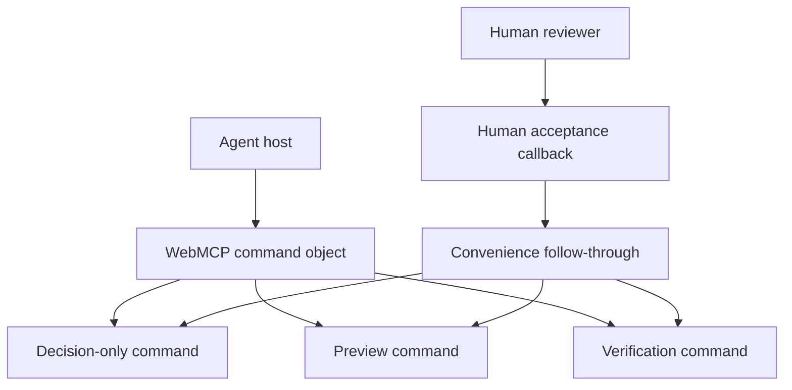
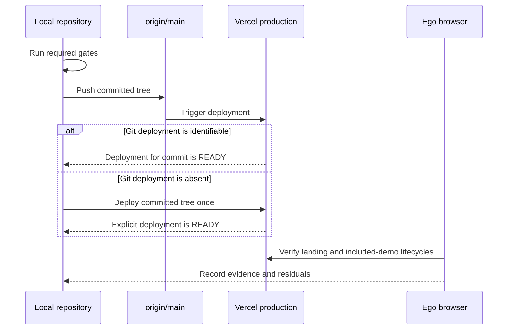

# Production Release Contract - Plan

## Goal Capsule

- **Objective:** Sundae's refined landing and workbench are live in production with truthful agent behavior and fresh end-to-end evidence.
- **Means:** Separate the agent decision command from the human convenience flow, complete the repository gates, ship one traceable Vercel deployment from `main`, and inspect production through the user's real Chromium session. (KTD1, KTD2, KTD3)
- **Authority:** The user's release request governs scope. This plan governs execution details. Repository contracts and tests govern implementation.
- **Execution profile:** Production release with a narrow contract fix, full local gates, reversible deployment evidence, and browser verification.
- **Stop conditions:** Stop before push if a required gate fails or the release diff contains unexplained changes. Stop before claiming production if the deployed artifact cannot be tied to the committed tree. Report host-only Site Tools checks as residual work when the ego-browser runtime cannot perform them.
- **Tail ownership:** The same release run owns the commit, push, deployment confirmation, production QA, rollback coordinates, and Beads closeout.

---

## Product Contract

### Summary

Release the completed landing and workbench refinement after correcting one agent-command contract defect. Preserve the human review flow while making the agent's decision, preview, and verification steps distinct and auditable. Prove the current production artifact with fresh local and browser evidence.

### Problem Frame

The visual refinement is locally complete but uncommitted and production still serves the previous experience. A source trace also shows that the public `set_finding_decision` tool can silently preview and verify, despite promising a decision-only action. Shipping that state would make tool counts and evidence receipts unreliable in the exact judge journey the redesign is meant to explain.

### Actors

- A1. **Reviewer:** Opens Sundae, gives decision authority, and judges whether receipts match visible state.
- A2. **Agent host:** Discovers Sundae's WebMCP tools and invokes only the authorized step.
- A3. **Release operator:** Commits, deploys, verifies, and retains rollback coordinates.
- A4. **Vercel:** Builds and serves the production Next.js artifact.

### Requirements

**Behavior and evidence**

- R1. Preserve the approved landing, workbench onboarding, responsive launcher, included-demo proof, and current visual direction.
- R2. An agent `set_finding_decision` call records one reasoned decision and does not start preview, verification, or a new audit.
- R3. Human acceptance may retain its convenience follow-through, but a failed step must produce a visible accessible error, preserve the valid completed state, keep the appropriate retry control available, and never claim unfinished preview or verification work.
- R4. Preview and fresh verification remain separately invokable and produce distinct receipts and state transitions.

**Release safety**

- R5. The complete release diff passes the repository's required `npm run check` gate and whitespace validation without weakened rules.
- R6. The release is committed and pushed on `main`, and the production deployment is tied to that committed tree before it is called live.
- R7. The unchanged worker is not deployed.
- R8. The release retains the previous `main` SHA and deployment identifier as rollback coordinates.

**Production verification**

- R9. The production landing is usable at desktop, 390 x 844, and 320 x 844 without horizontal page overflow; the primary action is visible and interactive, and the 320px demo-link placement is reported if it remains below the first viewport.
- R10. A fresh `/demo` session starts on the included target with zero agent-authored receipts or tool calls, while allowing its system baseline receipt, and completes two measure-to-verification lifecycles with decision, preview, and verification observable as distinct steps.
- R11. Production negative controls prove `/mcp` returns 404 and unsafe, loopback, private, and unsupported capture targets fail before provider work.
- R12. Ego-browser evidence distinguishes ordinary Chromium rendering and human controls from a supported ChatGPT Desktop or official WebMCP host-panel verification.

### Key Flows

- F1. **Agent review lifecycle**
  - **Trigger:** A fresh included-demo workspace is opened.
  - **Actors:** A1, A2
  - **Steps:** Audit the current scope, read every board page, inspect the agent surface, focus a finding, obtain a reasoned decision, record the decision, preview, verify from a fresh recapture, and reread the board and receipts.
  - **Outcome:** The decision, preview, and verification remain separately attributable and the verified state has fresh evidence.
  - **Covered by:** R2, R4, R10, R12
- F2. **Production release**
  - **Trigger:** The release diff and regression tests pass locally.
  - **Actors:** A3, A4
  - **Steps:** Record rollback coordinates, commit the exact tree, push `main`, identify the resulting Vercel deployment or create one from the committed tree, wait for `READY`, then run production QA.
  - **Outcome:** The canonical URL serves the verified committed artifact.
  - **Covered by:** R5, R6, R7, R8

### Acceptance Examples

- AE1. **Agent decision stays decision-only**
  - **Covers:** R2, R4
  - **Given:** A measured finding is focused and the reviewer has supplied an accepted decision with a reason.
  - **When:** The agent calls `set_finding_decision`.
  - **Then:** One decision receipt is recorded, preview state is unchanged, and `preview_fix` and `verify_recapture` remain separate available actions.
- AE2. **Human follow-through fails truthfully**
  - **Covers:** R3
  - **Given:** A human acceptance starts the convenience follow-through.
  - **When:** Preview or verification fails.
  - **Then:** The decision remains recorded, a persistent accessible error reports incomplete follow-through, no text says the finding was verified, and the next valid retry control remains available.
- AE3. **Fresh production lifecycle**
  - **Covers:** R9, R10, R12
  - **Given:** Production is opened in a fresh ego-browser task space.
  - **When:** The reviewer completes the included-demo flow twice and reloads between baselines.
  - **Then:** Initial agent-authored activity is empty while the system baseline may be visible, each transition is visible, no stale state leaks across the reload, and host-only claims are limited to the runtime evidence available.

### Scope Boundaries

- Preserve the current redesign. Do not start another copy or visual-direction pass.
- Make only release-blocking behavioral, truthfulness, or verification fixes discovered during this run.
- Do not deploy the Cloudflare worker because the release does not change it.
- Do not treat historical `.local/contest/PRODUCTION.md` evidence as proof of this release.

### Sources

- `lib/webmcp/register.ts` owns the public decision, preview, and verification tool descriptions and their call sequence.
- `components/Workbench.tsx` owns the command mapping and the separate human decision callback.
- `tests/eval-manifest.test.ts` encodes the intended decision, preview, and verification order.
- `.local/reference/DEPLOYMENT.md` describes the Vercel production path; it is a runbook, not proof of a completed deployment.
- `.local/contest/JUDGE-SMOKE-TEST.md` defines the judge lifecycle and negative controls.
- `.local/contest/LIMITATIONS.md` and `.local/reference/WEBMCP.md` define the supported Site Tools host boundary.

---

## Planning Contract

### Key Technical Decisions

- KTD1. **Split the command boundary, not the human interaction.** The WebMCP command object exposes the base decision-only command, while the visible human callback may keep the follow-through wrapper. Governs R2, R3, R4.
- KTD2. **Deploy one committed artifact.** Push `main`, wait a bounded interval for the Git-triggered deployment to reach a terminal state, and match its source SHA. Use the authenticated linked-project fallback only after that gate, from a clean checkout of the exact pushed SHA, while recording every deployment identifier. Stop if provenance remains ambiguous. Governs R6, R8.
- KTD3. **Keep browser claims runtime-specific.** Ego-browser proves the real production page and human flow; it proves the 11 named Sundae tools only when the active runtime exposes them, and never substitutes registration for a ChatGPT host-panel check. Governs R10, R12.
- KTD4. **Treat the worker as a separate release surface.** Root production deployment excludes `worker/`, and this release does not invoke the worker deploy path. Governs R7.
- KTD5. **Use fresh evidence for the current tree.** Test counts, browser receipts, deployment status, and residuals come from this run rather than older contest notes. Governs R5, R6, R8, R9, R10, R11, R12.

### High-Level Technical Design

The command boundary keeps the automated protocol explicit while preserving the existing human shortcut.

The release and proof sequence keeps build identity ahead of production claims.

### Assumptions

- The current uncommitted landing and workbench refinement is the release candidate, subject to final diff review.
- The canonical production origin remains `https://usesundae.vercel.app`.
- The user's instruction authorizes the required commit, push, Vercel deployment, and production browser interaction.
- Ordinary Chromium may not expose the supported ChatGPT Site Tools host. That limitation does not block production rendering or human-flow QA, but it blocks a host-panel verification claim.

### Risks and Dependencies

- A Vercel Git integration may deploy automatically after push, but repository files do not prove that integration. KTD2 prevents duplicate deployments while preserving a manual fallback.
- A preview can succeed before verification fails. Failure receipts must describe the partial state without implying rollback or verification that did not occur.
- A production service worker, CDN edge, or browser cache can show stale content. Verification must use a fresh task space and compare distinctive release copy or behavior after the deployment is `READY`.
- Public capture depends on external provider configuration. The included `/demo` flow is the zero-key release-critical path; provider-dependent checks remain bounded negative tests.

---

## Implementation Units

### U1. Restore the agent decision contract

- **Goal:** Make agent decisions atomic while preserving truthful human follow-through.
- **Requirements:** R2, R3, R4; AE1, AE2; KTD1.
- **Dependencies:** None.
- **Files:** `components/Workbench.tsx`, `lib/workbench/accept-follow-through.ts`, `tests/accept-follow-through.test.ts`, `tests/public-surface.test.ts`, and an existing command-boundary test file if it provides stronger behavioral coverage.
- **Approach:**
  1. Expose the base decision function through the command object registered with WebMCP.
  2. Keep the follow-through wrapper on the visible human decision callback.
  3. Surface thrown or incomplete follow-through through the existing accessible error region, preserve completed state, and leave the applicable preview, verification, or remeasurement retry available.
  4. Add regression coverage at the narrowest existing seams without adding a general abstraction only for testing.
- **Patterns to follow:** Preserve `WorkbenchCommands`, the separate `previewFix` and `verifyRecapture` methods, existing reversible-transition behavior, and Node test conventions.
- **Test scenarios:**
  - Covers AE1. An accepted agent decision records a decision-only result and does not invoke preview, verification, or audit.
  - Covers AE1. After the decision, preview and verification remain separately callable in the documented order.
  - Covers AE2. A preview exception after human acceptance returns an incomplete follow-through receipt that does not contain a verified claim.
  - Covers AE2. A verification exception after preview returns an incomplete follow-through receipt that identifies verification as pending or failed.
  - Covers AE2. A failed public remeasurement does not retain the completed remeasurement wording and leaves the accepted decision visible.
  - Covers AE2. The visible human-control path announces the incomplete follow-through and retains the next valid retry control.
  - Deferred, dismissed, and open decisions continue to skip follow-through.
- **Verification:** The tests prove the agent and human paths differ only at the intended orchestration boundary, and all receipts describe completed work only.

### U2. Finalize the release candidate

- **Goal:** Establish one clean, coherent tree that is safe to ship.
- **Requirements:** R1, R5; KTD5.
- **Dependencies:** U1.
- **Files:** The complete Git diff, `SUBMISSION.md` for its current test-count claim, and all tests changed by the landing/workbench refinement.
- **Approach:**
  1. Review tracked and untracked changes for accidental files, stale claims, token violations, and unrelated edits.
  2. Reconcile `SUBMISSION.md`'s current test-count claim from the final gate without rewriting historical contest narrative.
  3. Run the strongest repository gate from the exact tree to be committed.
- **Execution note:** Treat the current 230-test result as prior evidence only; rerun the gate after U1 and any final claim correction.
- **Patterns to follow:** The product token contract, the complexity ceiling, `package.json` scripts, and current landing geometry tests.
- **Test scenarios:**
  - The included proof receipt is derived from the fixture measurement rather than an unrelated product statistic.
  - Desktop, 390px, and 320px geometry checks keep the primary action usable and page overflow at zero.
  - The complete TypeScript, lint, token, format, unit-test, and production-build gate passes with the final files.
- **Verification:** The diff is explainable file by file, contains no debug or secret material, passes whitespace validation, and completes `npm run check` without rule changes.

### U3. Ship a traceable production deployment

- **Goal:** Put the committed release candidate on the canonical production origin without touching the worker.
- **Requirements:** R6, R7, R8; F2; KTD2, KTD4.
- **Dependencies:** U2.
- **Files:** Git history and the linked Vercel project metadata; no product-source changes are expected in this unit.
- **Approach:**
  1. Record the previous `main` SHA and current production deployment identifier.
  2. Commit the exact verified tree and push `main`.
  3. Require the repository check workflow to pass for the pushed SHA.
  4. Poll the Git-triggered Vercel deployment through a bounded interval and require its source SHA to match.
  5. If that deployment does not exist after the bounded gate, authenticate and link the Vercel CLI per `.local/reference/DEPLOYMENT.md`, then deploy once from a clean checkout at the exact pushed SHA.
  6. Record every deployment identifier and confirm the canonical domain serves the selected `READY` artifact before production QA.
- **Test expectation:** None -- this unit changes release state rather than product behavior; deployment identity and readiness are its executable evidence.
- **Verification:** The pushed SHA passes CI, the production deployment is `READY`, resolves at the canonical origin, and is tied to that SHA; the previous SHA and deployment remain available for rollback.

### U4. Run production ego-browser QA and close the release

- **Goal:** Verify the production experience through a real browser and report only claims the runtime proves.
- **Requirements:** R9, R10, R11, R12; F1; AE3; KTD3, KTD5.
- **Dependencies:** U3.
- **Files:** No product files are expected; durable release evidence belongs in the active Beads task and the final handoff.
- **Approach:**
  1. Use one fresh ego-browser task space for the canonical landing and included demo.
  2. Inspect desktop, 390 x 844, and 320 x 844 layouts, keyboard focus, disclosures, actions, tap targets, and page overflow.
  3. Run `SUNDAE_GEOMETRY_ORIGIN=https://usesundae.vercel.app npm run verify:production` so the automated production geometry check fails closed and is pinned to the canonical origin.
  4. Confirm `/demo` redirect, included target, zero initial agent-authored receipts or tool calls, the allowed system baseline receipt, and tool status.
  5. Complete F1 in the exact documented order, including a nonzero board pagination offset, and repeat it from a fresh baseline.
  6. Check `/mcp` and rejected target classes without invoking provider work.
  7. Record the distinction between DOM registration, ego-browser tool discovery, ordinary human controls, and a supported host-panel check.
- **Execution note:** If the ego runtime cannot call WebMCP tools, complete the equivalent human-control lifecycle and record the host-only tool lifecycle as a residual rather than simulating it.
- **Test scenarios:**
  - Covers AE3. Fresh load has no stale activity, the included target is active, and the expected current copy is visible.
  - Two full lifecycles produce separately observable decisions, previews, fresh verification receipts, and consistent tool-call counts when the runtime exposes the tools.
  - The 11 named Sundae tools are counted separately from the two nested fixture tools when discovery is available.
  - Keyboard-only navigation reaches the primary launcher, demo link, disclosures, and review controls with visible focus.
  - `/mcp` returns 404 and unsafe, loopback, private, and unsupported targets fail before capture work.
  - The page has no horizontal overflow at each required viewport, and any below-fold 320px demo link is reported as a residual.
- **Verification:** Fresh screenshots, DOM measurements, visible receipts, HTTP results, and deployment identity support every release claim; unsupported host-only checks are clearly listed.

---

## Verification Contract

| Gate                          | Applies to | Done signal                                                                                                                  |
| ----------------------------- | ---------- | ---------------------------------------------------------------------------------------------------------------------------- |
| `git diff --check`            | U1, U2     | No whitespace errors in the release diff.                                                                                    |
| `npm run check`               | U1, U2     | Typecheck, lint, token lint, formatting, all tests, and production build pass from the final tree.                           |
| GitHub `check` workflow       | U3         | The Node 24 clean-install workflow passes for the pushed `main` SHA.                                                         |
| Git and Vercel identity check | U3         | Pushed `main` commit and `READY` production deployment are traceable to one artifact after the bounded resolution gate.      |
| Canonical-origin HTTP smoke   | U3, U4     | Root and `/demo` resolve as expected; `/mcp` is 404.                                                                         |
| Ego-browser responsive QA     | U4         | Desktop, 390px, and 320px evidence proves layout, focus, actions, and overflow behavior.                                     |
| Ego-browser lifecycle QA      | U4         | Two fresh included-demo lifecycles complete with accurate receipts, or the unsupported host portion is recorded as residual. |

The production check must use the deployed canonical origin, not a local server. A passing local browser run is supporting evidence only.

---

## Definition of Done

- U1 is complete when agent decision calls are atomic, the human convenience path remains truthful, and regression tests cover both paths.
- U2 is complete when every release file is intentional and the final tree passes `git diff --check` and `npm run check`.
- U3 is complete when `main` contains the verified commit, the canonical production deployment is `READY` for that artifact, and worker state is unchanged.
- Production is **render-ready** when U4 proves the landing, human included-demo lifecycle, responsive layouts, keyboard path, and negative controls in ego-browser.
- The judge path is **WebMCP host-verified** only when one supported Site Tools host completes the explicit agent lifecycle; otherwise that status remains open and the final handoff names it without downgrading it to ordinary browser evidence.
- The release task is closed only after the commit, deployment, verification evidence, rollback coordinates, and residuals are saved in Beads.
- No abandoned experiment, debug instrumentation, temporary credential material, or dead-end code remains in the final tree.
